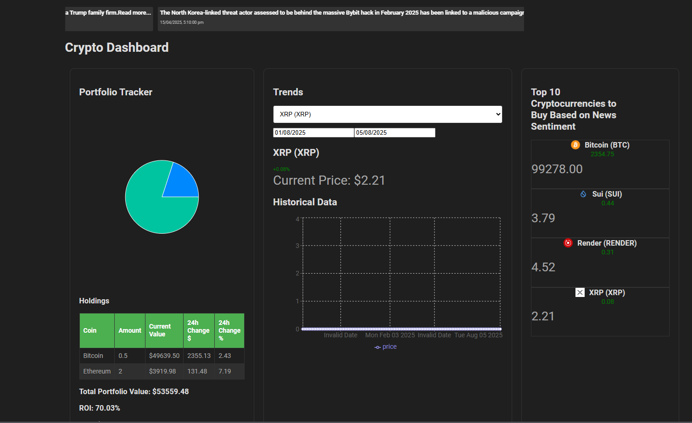

# Cryptocurrency Tracker

This project is a cryptocurrency tracker built with React JS and the CoinGecko API. It allows you to monitor real-time prices of your favorite cryptocurrencies and visualize their historical data.

## Prerequisites

Before you begin, ensure you have met the following requirements:

- You have installed the latest version of Node.js and npm.
- You have a CoinGecko account and an API key.

## Installing Dependencies

To install Cryptocurrency Tracker, follow these steps:

1. Clone the repository.
2. Navigate to the project directory.
3. Run `npm install` to install the necessary dependencies.

## Using Cryptocurrency Tracker

To use Cryptocurrency Tracker, follow these steps:

1. Replace the `api_key` in the `App` component with your own CoinGecko API key.
2. Run `npm start` to start the development server.
3. Open your web browser and navigate to `http://localhost:3000`.

**Special Offer:** Use my referral code `CGNINJACODERX` to get $500 off the annual premium plan!
## Contributing to Cryptocurrency Tracker

To contribute to Cryptocurrency Tracker, follow these steps:

1. Fork this repository.
2. Create a branch: `git checkout -b <branch_name>`.
3. Make your changes and commit them: `git commit -m '<commit_message>'`
4. Push to the original branch: `git push origin <project_name>/<location>`
5. Create the pull request.

## License

This project uses the following license: `<license_name>`.

## Acknowledgements

This project was inspired by the CoinGecko API. For more information on how to use the CoinGecko API, check out this official documentation and blog.

## Support the Project

If you find this project helpful, consider supporting it by donating cryptocurrency. Your support helps keep the project alive and maintained!

### Donation Wallets

- **Bitcoin (BTC):** `34rqfUFenX2EMvDfpn7phgiKdHbxTJ5Wuw`
- **Ethereum (ETH):** `0x0bB11fD9a3B8EfBd899325c2EA574e28E6E87cB2`
- **USDT (ERC-20):** `0x679c5733F4109283B46158AaD3a2C8981425c951`

Thank you for your support! 🙏